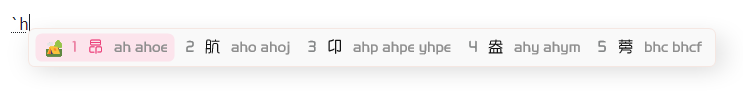
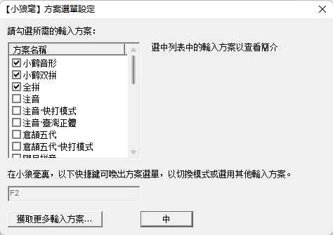
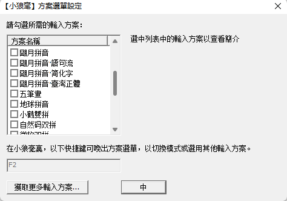
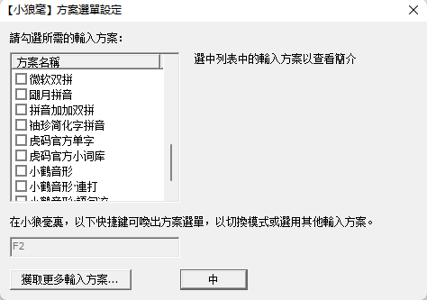
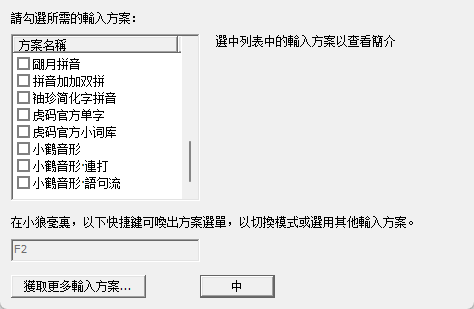

# RIME

> 当前未在 MacOS 中调试，所以只适配了 Windows 系统

# 皮肤预览（Windows）

> rime 黑色主题


> 亮色主题



使用的字体为悦圆（商用需购买，个人可以免费使用）

# 使用

安装步骤： 备份原有配置（如果有的话）下载[仓库压缩包](git@github.com:rwerplus/rime.git) 并解压 打开 用户设定 将本仓库中除了 README.md、resouces 文件夹除外的所有文件复制到 用户设定 文件夹中 重新部署鼠须管 Windows 个人主要使用 Windows，所以其它平台的配置可能会有些小问题

～ 注意 ⚠️：Windows 7 只能使用 0.14.3 版本

# 自定义

## 如何同步

在根目录下添加 installation.yaml 文件，并在其中添加

```yaml
distribution_code_name: Weasel
distribution_name: "小狼毫"
distribution_version: 0.15.0.0
install_time: "Wed Dec  9 15:32:16 2020"
installation_id: "a67da375-4ab1-4331-be02-078713dfce08"
rime_version: 1.8.5
sync_dir: "D:\\Rime\\Win"
update_time: "Wed Sep 13 10:23:33 2023"
```

> 其中 sync_dir 为同步路径，可以使用 webdav 进行同步此文件夹

## 如何修改主题

在 weasel.custom.yaml 文件中修改使用的主题名称，并在 weasel.yaml 中修改主题色，其中大部分都添加了注释，可根据提示修改即可；

```yaml
tips: __include属性为预设主题配置
```

# 支持的词库





